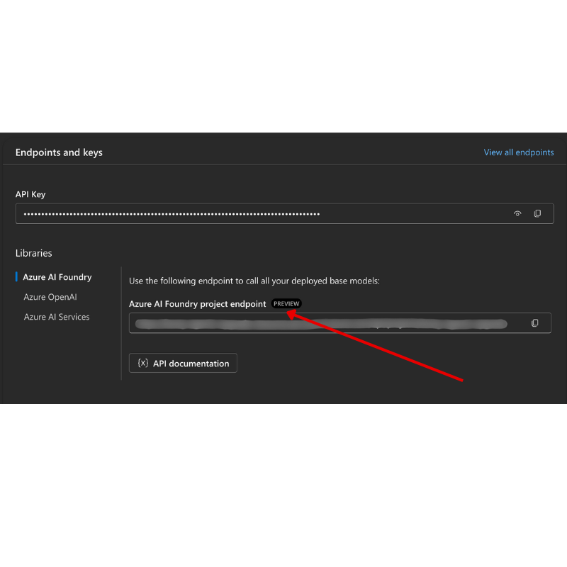

<!--
CO_OP_TRANSLATOR_METADATA:
{
  "original_hash": "76945069b52a49cd0432ae3e0b0ba22e",
  "translation_date": "2025-06-17T08:36:53+00:00",
  "source_file": "00-course-setup/README.md",
  "language_code": "de"
}
-->
in deinem GitHub-Konto.

Wähle die Option `Fine-grained tokens` option on the left side of your screen.

Then select `Generate new token`.


You will be prompted to enter a name for your token, select the expiration date (Recommended: 30 Days), and select the scopes for your token (Public Repositories).

It's also necessary to edit the permissions of this token: Permissions -> Models -> Allows access to GitHub Models

Copy your new token that you have just created. You will now add this to your `.env` file included in this course. 


### Step 2: Create Your `.env` File

To create your `.env` Datei und führe den folgenden Befehl in deinem Terminal aus.

```bash
cp .env.example .env
```

Dies kopiert die Beispieldatei und erstellt eine `.env` in your directory and where you fill in the values for the environment variables.

With your token copied, open the `.env` file in your favorite text editor and paste your token into the `GITHUB_TOKEN` field.

You should now be able to run the code samples of this course.

## Set Up for Samples using Azure AI Foundry and Azure AI Agent Service

### Step 1: Retrieve Your Azure Project Endpoint


Follow the steps to creating a hub and project in Azure AI Foundry found here: [Hub resources overview](https://learn.microsoft.com/en-us/azure/ai-foundry/concepts/ai-resources)


Once you have created your project, you will need to retrieve the connection string for your project.

This can be done by going to the **Overview** page of your project in the Azure AI Foundry portal.



### Step 2: Create Your `.env` File

To create your `.env` Datei. Führe den folgenden Befehl in deinem Terminal aus.

```bash
cp .env.example .env
```

Dies kopiert die Beispieldatei und erstellt eine `.env` in your directory and where you fill in the values for the environment variables.

With your token copied, open the `.env` file in your favorite text editor and paste your token into the `PROJECT_ENDPOINT` field.

### Step 3: Sign in to Azure

As a security best practice, we'll use [keyless authentication](https://learn.microsoft.com/azure/developer/ai/keyless-connections?tabs=csharp%2Cazure-cli?WT.mc_id=academic-105485-koreyst) to authenticate to Azure OpenAI with Microsoft Entra ID. Before you can do so, you'll first need to install the **Azure CLI** per the [installation instructions](https://learn.microsoft.com/cli/azure/install-azure-cli?WT.mc_id=academic-105485-koreyst) for your operating system.

Next, open a terminal and run `az login --use-device-code` to sign in to your Azure account.

Once you've logged in, select your subscription in the terminal.


## Additional Environment Variables - Azure Search and Azure OpenAI 

For the Agentic RAG Lesson - Lesson 5 - there are samples that use Azure Search and Azure OpenAI.

If you want to run these samples, you will need to add the following environment variables to your `.env` file:

### Overview Page (Project)

- `AZURE_SUBSCRIPTION_ID` - Check **Project details** on the **Overview** page of your project.

- `AZURE_AI_PROJECT_NAME` - Look at the top of the **Overview** page for your project.

- `AZURE_OPENAI_SERVICE` - Find this in the **Included capabilities** tab for **Azure OpenAI Service** on the **Overview** page.

### Management Center

- `AZURE_OPENAI_RESOURCE_GROUP` - Go to **Project properties** on the **Overview** page of the **Management Center**.

- `GLOBAL_LLM_SERVICE` - Under **Connected resources**, find the **Azure AI Services** connection name. If not listed, check the **Azure portal** under your resource group for the AI Services resource name.

### Models + Endpoints Page

- `AZURE_OPENAI_EMBEDDING_DEPLOYMENT_NAME` - Select your embedding model (e.g., `text-embedding-ada-002`) and note the **Deployment name** from the model details.

- `AZURE_OPENAI_CHAT_DEPLOYMENT_NAME` - Select your chat model (e.g., `gpt-4o-mini`) and note the **Deployment name** from the model details.

### Azure Portal

- `AZURE_OPENAI_ENDPOINT` - Look for **Azure AI services**, click on it, then go to **Resource Management**, **Keys and Endpoint**, scroll down to the "Azure OpenAI endpoints", and copy the one that says "Language APIs".

- `AZURE_OPENAI_API_KEY` - From the same screen, copy KEY 1 or KEY 2.

- `AZURE_SEARCH_SERVICE_ENDPOINT` - Find your **Azure AI Search** resource, click it, and see **Overview**.

- `AZURE_SEARCH_API_KEY` - Then go to **Settings** and then **Keys** to copy the primary or secondary admin key.

### External Webpage

- `AZURE_OPENAI_API_VERSION` - Visit the [API version lifecycle](https://learn.microsoft.com/en-us/azure/ai-services/openai/api-version-deprecation#latest-ga-api-release) page under **Latest GA API release**.

### Setup keyless authentication

Rather than hardcode your credentials, we'll use a keyless connection with Azure OpenAI. To do so, we'll import `DefaultAzureCredential` and later call the `DefaultAzureCredential` Funktion, um die Anmeldeinformationen zu erhalten.

```python
from azure.identity import DefaultAzureCredential, InteractiveBrowserCredential
```

## Stecken geblieben?

Wenn du Probleme bei der Einrichtung hast, komm gerne in unseren

oder

.

## Nächste Lektion

Du bist jetzt bereit, den Code für diesen Kurs auszuführen. Viel Erfolg und Spaß beim weiteren Entdecken der Welt der KI-Agenten!

[Einführung in KI-Agenten und Anwendungsfälle von Agenten](../01-intro-to-ai-agents/README.md)

**Haftungsausschluss**:  
Dieses Dokument wurde mit dem KI-Übersetzungsdienst [Co-op Translator](https://github.com/Azure/co-op-translator) übersetzt. Obwohl wir uns um Genauigkeit bemühen, beachten Sie bitte, dass automatisierte Übersetzungen Fehler oder Ungenauigkeiten enthalten können. Das Originaldokument in seiner Ursprungssprache ist als maßgebliche Quelle zu betrachten. Für wichtige Informationen wird eine professionelle menschliche Übersetzung empfohlen. Wir übernehmen keine Haftung für Missverständnisse oder Fehlinterpretationen, die aus der Nutzung dieser Übersetzung entstehen.