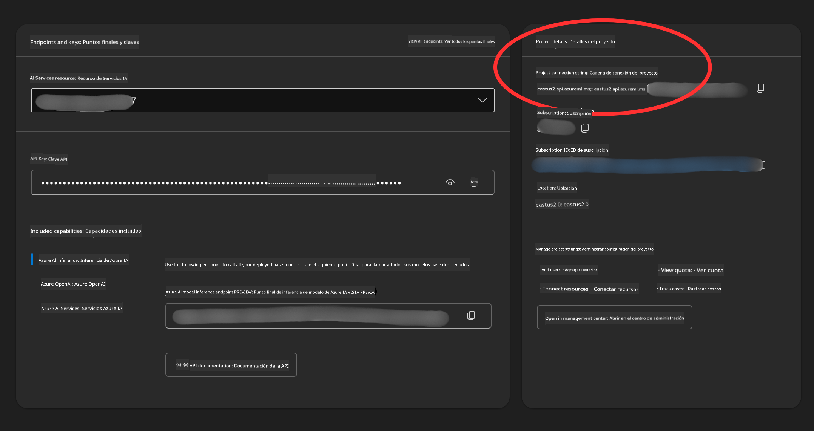

<!--
CO_OP_TRANSLATOR_METADATA:
{
  "original_hash": "49fa13c21a816ffcc7740ab17ba024a9",
  "translation_date": "2025-05-20T08:55:10+00:00",
  "source_file": "00-course-setup/README.md",
  "language_code": "es"
}
-->
en tu cuenta de GitHub.

Selecciona los `Fine-grained tokens` option on the left side of your screen.

Then select `Generar nuevo token`.


You will be prompted to enter a name for your token, select the expiration date (Recommended: 30 Days), and select the scopes for your token (Public Repositories).

Copy your new token that you have just created. You will now add this to your `.env` file included in this course. 


### Step 2: Create Your `.env` File

To create your `.env` archivo y ejecuta el siguiente comando en tu terminal.

```bash
cp .env.example .env
```

Esto copiará el archivo de ejemplo y creará un archivo `.env` in your directory and where you fill in the values for the environment variables.

With your token copied, open the `.env` file in your favorite text editor and paste your token into the `GITHUB_TOKEN` field.

You should now be able to run the code samples of this course.

## Set Up for Samples using Azure AI Foundry and Azure AI Agent Service

### Step 1: Retrieve Your Azure Project Connection String

Follow the steps to creating a project and agent in Azure AI Foundry found here: [Create a project in Azure AI Foundry](https://learn.microsoft.com/en-us/azure/ai-services/agents/quickstart?pivots=ai-foundry-portal?WT.mc_id=academic-105485-koreyst)

Once you have created your project, you will need to retrieve the connection string for your project.

This can be done by going to the **Overview** page of your project in the Azure AI Foundry portal.



### Step 2: Create Your `.env` File

To create your `.env` ejecuta el siguiente comando en tu terminal.

```bash
cp .env.example .env
```

Esto copiará el archivo de ejemplo y creará un archivo `.env` in your directory and where you fill in the values for the environment variables.

With your token copied, open the `.env` file in your favorite text editor and paste your token into the `PROJECT_CONNECTION_STRING` field.

### Step 3: Sign in to Azure

As a security best practice, we'll use [keyless authentication](https://learn.microsoft.com/azure/developer/ai/keyless-connections?tabs=csharp%2Cazure-cli?WT.mc_id=academic-105485-koreyst) to authenticate to Azure OpenAI with Microsoft Entra ID. Before you can do so, you'll first need to install the **Azure CLI** per the [installation instructions](https://learn.microsoft.com/cli/azure/install-azure-cli?WT.mc_id=academic-105485-koreyst) for your operating system.

Next, open a terminal and run `az login --use-device-code` to sign in to your Azure account.

Once you've logged in, select your subscription in the terminal.


## Additional Envionment Variables - Azure Search and Azure OpenAI 

For the Agentic RAG Lesson - Lesson 5 - there are samples that use Azure Search and Azure OpenAI.

If you want to run these samples, you will need to add the following environment variables to your `.env` file:

### Overview Page (Project)

- `AZURE_SUBSCRIPTION_ID` - Check **Project details** on the **Overview** page of your project.

- `AZURE_AI_PROJECT_NAME` - Look at the top of the **Overview** page for your project.

- `AZURE_OPENAI_SERVICE` - Find this in the **Included capabilities** tab for **Azure OpenAI Service** on the **Overview** page.

### Management Center

- `AZURE_OPENAI_RESOURCE_GROUP` - Go to **Project properties** on the **Overview** page of the **Management Center**.

- `GLOBAL_LLM_SERVICE` - Under **Connected resources**, find the **Azure AI Services** connection name. If not listed, check the **Azure portal** under your resource group for the AI Services resource name.

### Models + Endpoints Page

- `AZURE_OPENAI_EMBEDDING_DEPLOYMENT_NAME` - Select your embedding model (e.g., `text-embedding-ada-002`) and note the **Deployment name** from the model details.

- `AZURE_OPENAI_CHAT_DEPLOYMENT_NAME` - Select your chat model (e.g., `gpt-4o-mini`) and note the **Deployment name** from the model details.

### Azure Portal

- `AZURE_OPENAI_ENDPOINT` - Look for **Azure AI services**, click on it, then go to **Resource Management**, **Keys and Endpoint**, scroll down to the "Azure OpenAI endpoints", and copy the one that says "Language APIs".

- `AZURE_OPENAI_API_KEY` - From the same screen, copy KEY 1 or KEY 2.

- `AZURE_SEARCH_SERVICE_ENDPOINT` - Find your **Azure AI Search** resource, click it, and see **Overview**.

- `AZURE_SEARCH_API_KEY` - Then go to **Settings** and then **Keys** to copy the primary or secondary admin key.

### External Webpage

- `AZURE_OPENAI_API_VERSION` - Visit the [API version lifecycle](https://learn.microsoft.com/en-us/azure/ai-services/openai/api-version-deprecation#latest-ga-api-release) page under **Latest GA API release**.

### Setup keyless authentication

Rather than hardcode your credentials, we'll use a keyless connection with Azure OpenAI. To do so, we'll import `DefaultAzureCredential` and later call the `DefaultAzureCredential` función para obtener las credenciales.

```python
from azure.identity import DefaultAzureCredential, InteractiveBrowserCredential
```

## ¿Atascado en algún lugar?

Si tienes algún problema ejecutando esta configuración, únete a nuestro

o

.

## Próxima lección

Ahora estás listo para ejecutar el código de este curso, ¡feliz aprendizaje sobre el mundo de los Agentes de IA!

[Introducción a los Agentes de IA y casos de uso de Agentes](../01-intro-to-ai-agents/README.md)

**Aviso legal**:  
Este documento ha sido traducido utilizando el servicio de traducción automática [Co-op Translator](https://github.com/Azure/co-op-translator). Aunque nos esforzamos por la precisión, tenga en cuenta que las traducciones automáticas pueden contener errores o inexactitudes. El documento original en su idioma nativo debe considerarse la fuente autorizada. Para información crítica, se recomienda una traducción profesional realizada por humanos. No nos hacemos responsables por malentendidos o interpretaciones erróneas derivadas del uso de esta traducción.