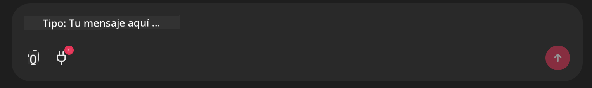

<!--
CO_OP_TRANSLATOR_METADATA:
{
  "original_hash": "393eea8000f305b94010dd5b380902d8",
  "translation_date": "2025-05-20T10:02:35+00:00",
  "source_file": "11-mcp/code_samples/github-mcp/README.md",
  "language_code": "es"
}
-->
# Ejemplo del Servidor MCP de Github

## Descripción

Esta fue una demo creada para el AI Agents Hackathon organizado por Microsoft Reactor.

La herramienta se usa para recomendar proyectos de hackathon basados en los repositorios de Github de un usuario.
Esto se realiza mediante:

1. **Github Agent** - Usa el Github MCP Server para obtener repositorios e información sobre esos repositorios.
2. **Hackathon Agent** - Toma los datos del Github Agent y genera ideas creativas para proyectos de hackathon basándose en los proyectos, los lenguajes usados por el usuario y las categorías del hackathon AI Agents.
3. **Events Agent** - Según la sugerencia del hackathon agent, el events agent recomendará eventos relevantes de la serie AI Agent Hackathon.

## Ejecutando el código

### Variables de Entorno

Esta demo utiliza Azure Open AI Service, Semantic Kernel, el Github MCP Server y Azure AI Search.

Asegúrate de tener configuradas las variables de entorno adecuadas para usar estas herramientas:

```python
AZURE_OPENAI_CHAT_DEPLOYMENT_NAME=""
AZURE_OPENAI_EMBEDDING_DEPLOYMENT_NAME=""
AZURE_OPENAI_ENDPOINT=""
AZURE_OPENAI_API_KEY=""
AZURE_OPENAI_API_VERSION=""
AZURE_SEARCH_SERVICE_ENDPOINT=""
AZURE_SEARCH_API_KEY=""
``` 

## Ejecutando el Servidor Chainlit

Para conectarse al servidor MCP, esta demo usa Chainlit como interfaz de chat.

Para iniciar el servidor, usa el siguiente comando en tu terminal:

```bash
chainlit run app.py -w
```

Esto debería iniciar tu servidor Chainlit en `localhost:8000` as well as populate your Azure AI Search Index with the `event-descriptions.md` content.

## Conectándose al Servidor MCP

Para conectarte al Github MCP Server, selecciona el ícono de "enchufe" debajo del cuadro de chat "Type your message here..":



Desde ahí puedes hacer clic en "Connect an MCP" para añadir el comando que conecta al Github MCP Server:

```bash
npx -y @modelcontextprotocol/server-github --env GITHUB_PERSONAL_ACCESS_TOKEN=[YOUR PERSONAL ACCESS TOKEN]
```

Reemplaza "[YOUR PERSONAL ACCESS TOKEN]" con tu token de acceso personal real.

Después de conectarte, deberías ver un (1) junto al ícono de enchufe para confirmar que está conectado. Si no, intenta reiniciar el servidor chainlit con `chainlit run app.py -w`.

## Usando la Demo

Para iniciar el flujo de trabajo del agente que recomienda proyectos de hackathon, puedes escribir un mensaje como:

"Recommend hackathon projects for the Github user koreyspace"

**Actualmente hemos programado esto para detectar las palabras "reccomend" y "github" para iniciar este flujo. Más adelante, esto será manejado por un Router Agent.**

**Descargo de responsabilidad**:  
Este documento ha sido traducido utilizando el servicio de traducción automática [Co-op Translator](https://github.com/Azure/co-op-translator). Aunque nos esforzamos por la precisión, tenga en cuenta que las traducciones automáticas pueden contener errores o inexactitudes. El documento original en su idioma nativo debe considerarse la fuente autorizada. Para información crítica, se recomienda una traducción profesional realizada por humanos. No nos hacemos responsables de malentendidos o interpretaciones erróneas derivadas del uso de esta traducción.