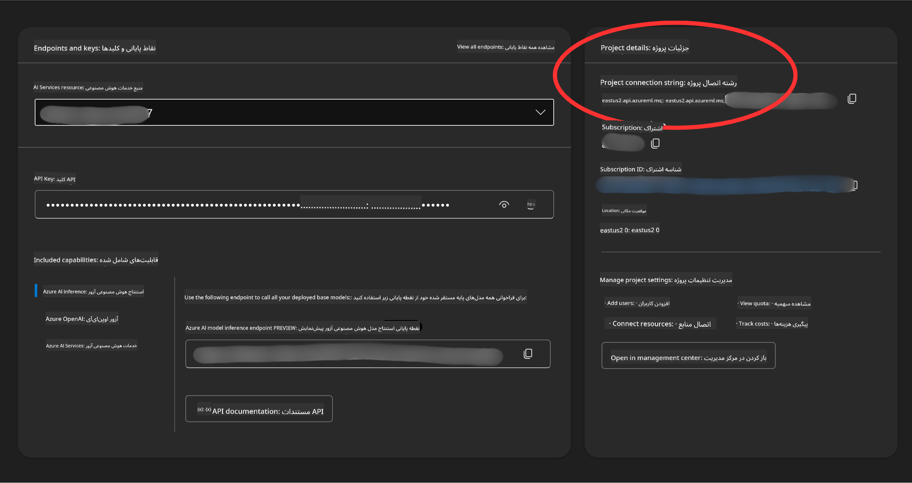

<!--
CO_OP_TRANSLATOR_METADATA:
{
  "original_hash": "49fa13c21a816ffcc7740ab17ba024a9",
  "translation_date": "2025-05-20T09:17:35+00:00",
  "source_file": "00-course-setup/README.md",
  "language_code": "fa"
}
-->
اکنون باید نسخه فورک‌شده خود از این دوره را در لینک زیر داشته باشید:


## اجرای کد

این دوره شامل مجموعه‌ای از نوت‌بوک‌های Jupyter است که می‌توانید آن‌ها را اجرا کنید تا تجربه عملی در ساخت عامل‌های هوش مصنوعی کسب کنید.

نمونه‌های کد از یکی از موارد زیر استفاده می‌کنند:

**نیازمند حساب GitHub - رایگان**:

1) چارچوب Semantic Kernel Agent به همراه بازار مدل‌های GitHub. با عنوان (semantic-kernel.ipynb)
2) چارچوب AutoGen به همراه بازار مدل‌های GitHub. با عنوان (autogen.ipynb)

**نیازمند اشتراک Azure**:
3) Azure AI Foundry به همراه سرویس Azure AI Agent. با عنوان (azureaiagent.ipynb)

ما شما را تشویق می‌کنیم تا هر سه نوع مثال را امتحان کنید تا ببینید کدام یک برای شما بهتر کار می‌کند.

هر گزینه‌ای که انتخاب کنید، مراحل راه‌اندازی مربوط به آن را باید در ادامه دنبال کنید:

## پیش‌نیازها

- Python 3.12 یا بالاتر
- حساب GitHub - برای دسترسی به بازار مدل‌های GitHub
- اشتراک Azure - برای دسترسی به Azure AI Foundry
- حساب Azure AI Foundry - برای دسترسی به سرویس Azure AI Agent

فایلی به نام `requirements.txt` در ریشه این مخزن قرار داده‌ایم که شامل تمام بسته‌های پایتون مورد نیاز برای اجرای نمونه‌های کد است.

می‌توانید آن‌ها را با اجرای دستور زیر در ترمینال خود در ریشه مخزن نصب کنید:

```bash
pip install -r requirements.txt
```
توصیه می‌کنیم برای جلوگیری از هرگونه تداخل و مشکل، یک محیط مجازی پایتون ایجاد کنید.

## راه‌اندازی برای نمونه‌هایی که از مدل‌های GitHub استفاده می‌کنند

### مرحله ۱: دریافت توکن دسترسی شخصی GitHub (PAT)

در حال حاضر، این دوره از بازار مدل‌های GitHub برای ارائه دسترسی رایگان به مدل‌های زبان بزرگ (LLM) استفاده می‌کند که برای ایجاد عامل‌های هوش مصنوعی به کار می‌روند.

برای دسترسی به این سرویس، باید یک توکن دسترسی شخصی GitHub ایجاد کنید.

این کار را می‌توانید با ورود به حساب GitHub خود انجام دهید.

گزینه `Fine-grained tokens` option on the left side of your screen.

Then select `Generate new token`.


You will be prompted to enter a name for your token, select the expiration date (Recommended: 30 Days), and select the scopes for your token (Public Repositories).

Copy your new token that you have just created. You will now add this to your `.env` file included in this course. 


### Step 2: Create Your `.env` File

To create your `.env` را انتخاب کنید و دستور زیر را در ترمینال خود اجرا کنید.

```bash
cp .env.example .env
```

این کار فایل نمونه را کپی کرده و یک فایل `.env` in your directory and where you fill in the values for the environment variables.

With your token copied, open the `.env` file in your favorite text editor and paste your token into the `GITHUB_TOKEN` field.

You should now be able to run the code samples of this course.

## Set Up for Samples using Azure AI Foundry and Azure AI Agent Service

### Step 1: Retrieve Your Azure Project Connection String

Follow the steps to creating a project and agent in Azure AI Foundry found here: [Create a project in Azure AI Foundry](https://learn.microsoft.com/en-us/azure/ai-services/agents/quickstart?pivots=ai-foundry-portal?WT.mc_id=academic-105485-koreyst)

Once you have created your project, you will need to retrieve the connection string for your project.

This can be done by going to the **Overview** page of your project in the Azure AI Foundry portal.



### Step 2: Create Your `.env` File

To create your `.env` ایجاد می‌کند. دستور زیر را در ترمینال خود اجرا کنید.

```bash
cp .env.example .env
```

این کار فایل نمونه را کپی کرده و یک فایل `.env` in your directory and where you fill in the values for the environment variables.

With your token copied, open the `.env` file in your favorite text editor and paste your token into the `PROJECT_CONNECTION_STRING` field.

### Step 3: Sign in to Azure

As a security best practice, we'll use [keyless authentication](https://learn.microsoft.com/azure/developer/ai/keyless-connections?tabs=csharp%2Cazure-cli?WT.mc_id=academic-105485-koreyst) to authenticate to Azure OpenAI with Microsoft Entra ID. Before you can do so, you'll first need to install the **Azure CLI** per the [installation instructions](https://learn.microsoft.com/cli/azure/install-azure-cli?WT.mc_id=academic-105485-koreyst) for your operating system.

Next, open a terminal and run `az login --use-device-code` to sign in to your Azure account.

Once you've logged in, select your subscription in the terminal.


## Additional Envionment Variables - Azure Search and Azure OpenAI 

For the Agentic RAG Lesson - Lesson 5 - there are samples that use Azure Search and Azure OpenAI.

If you want to run these samples, you will need to add the following environment variables to your `.env` file:

### Overview Page (Project)

- `AZURE_SUBSCRIPTION_ID` - Check **Project details** on the **Overview** page of your project.

- `AZURE_AI_PROJECT_NAME` - Look at the top of the **Overview** page for your project.

- `AZURE_OPENAI_SERVICE` - Find this in the **Included capabilities** tab for **Azure OpenAI Service** on the **Overview** page.

### Management Center

- `AZURE_OPENAI_RESOURCE_GROUP` - Go to **Project properties** on the **Overview** page of the **Management Center**.

- `GLOBAL_LLM_SERVICE` - Under **Connected resources**, find the **Azure AI Services** connection name. If not listed, check the **Azure portal** under your resource group for the AI Services resource name.

### Models + Endpoints Page

- `AZURE_OPENAI_EMBEDDING_DEPLOYMENT_NAME` - Select your embedding model (e.g., `text-embedding-ada-002`) and note the **Deployment name** from the model details.

- `AZURE_OPENAI_CHAT_DEPLOYMENT_NAME` - Select your chat model (e.g., `gpt-4o-mini`) and note the **Deployment name** from the model details.

### Azure Portal

- `AZURE_OPENAI_ENDPOINT` - Look for **Azure AI services**, click on it, then go to **Resource Management**, **Keys and Endpoint**, scroll down to the "Azure OpenAI endpoints", and copy the one that says "Language APIs".

- `AZURE_OPENAI_API_KEY` - From the same screen, copy KEY 1 or KEY 2.

- `AZURE_SEARCH_SERVICE_ENDPOINT` - Find your **Azure AI Search** resource, click it, and see **Overview**.

- `AZURE_SEARCH_API_KEY` - Then go to **Settings** and then **Keys** to copy the primary or secondary admin key.

### External Webpage

- `AZURE_OPENAI_API_VERSION` - Visit the [API version lifecycle](https://learn.microsoft.com/en-us/azure/ai-services/openai/api-version-deprecation#latest-ga-api-release) page under **Latest GA API release**.

### Setup keyless authentication

Rather than hardcode your credentials, we'll use a keyless connection with Azure OpenAI. To do so, we'll import `DefaultAzureCredential` and later call the `DefaultAzureCredential` را برای دریافت اعتبارنامه اجرا کنید.

```python
from azure.identity import DefaultAzureCredential, InteractiveBrowserCredential
```

## گیر کرده‌اید؟

اگر در اجرای این راه‌اندازی به مشکلی برخوردید، به کانال ما در

یا

مراجعه کنید.

## درس بعدی

اکنون آماده‌اید تا کد این دوره را اجرا کنید، از یادگیری بیشتر درباره دنیای عامل‌های هوش مصنوعی لذت ببرید!

[مقدمه‌ای بر عامل‌های هوش مصنوعی و موارد استفاده از عامل‌ها](../01-intro-to-ai-agents/README.md)

**سلب مسئولیت**:  
این سند با استفاده از سرویس ترجمه هوش مصنوعی [Co-op Translator](https://github.com/Azure/co-op-translator) ترجمه شده است. در حالی که ما در تلاش برای دقت هستیم، لطفاً توجه داشته باشید که ترجمه‌های خودکار ممکن است حاوی خطاها یا نواقصی باشند. سند اصلی به زبان بومی آن باید به عنوان منبع معتبر در نظر گرفته شود. برای اطلاعات حیاتی، ترجمه حرفه‌ای انسانی توصیه می‌شود. ما مسئول هیچ گونه سوءتفاهم یا برداشت نادرستی که ناشی از استفاده از این ترجمه باشد، نیستیم.