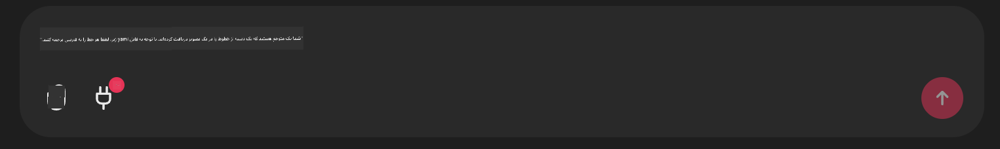

<!--
CO_OP_TRANSLATOR_METADATA:
{
  "original_hash": "393eea8000f305b94010dd5b380902d8",
  "translation_date": "2025-05-20T10:02:55+00:00",
  "source_file": "11-mcp/code_samples/github-mcp/README.md",
  "language_code": "fa"
}
-->
# مثال سرور Github MCP

## توضیحات

این یک نمونه آزمایشی بود که برای هکاتون AI Agents که توسط Microsoft Reactor برگزار شد، ساخته شده است.

این ابزار برای پیشنهاد پروژه‌های هکاتون بر اساس مخازن Github یک کاربر استفاده می‌شود.  
این کار به روش زیر انجام می‌شود:

1. **Github Agent** - استفاده از سرور Github MCP برای بازیابی مخازن و اطلاعات مربوط به آن‌ها.  
2. **Hackathon Agent** - داده‌های دریافتی از Github Agent را گرفته و ایده‌های خلاقانه پروژه‌های هکاتون را بر اساس پروژه‌ها، زبان‌های برنامه‌نویسی کاربر و مسیرهای پروژه در هکاتون AI Agents ارائه می‌دهد.  
3. **Events Agent** - بر اساس پیشنهاد Hackathon Agent، Events Agent رویدادهای مرتبط با سری هکاتون AI Agent را توصیه می‌کند.

## اجرای کد

### متغیرهای محیطی

این نمونه از سرویس Azure Open AI، Semantic Kernel، سرور Github MCP و Azure AI Search استفاده می‌کند.

مطمئن شوید که متغیرهای محیطی مناسب برای استفاده از این ابزارها تنظیم شده‌اند:

```python
AZURE_OPENAI_CHAT_DEPLOYMENT_NAME=""
AZURE_OPENAI_EMBEDDING_DEPLOYMENT_NAME=""
AZURE_OPENAI_ENDPOINT=""
AZURE_OPENAI_API_KEY=""
AZURE_OPENAI_API_VERSION=""
AZURE_SEARCH_SERVICE_ENDPOINT=""
AZURE_SEARCH_API_KEY=""
```

## اجرای سرور Chainlit

برای اتصال به سرور MCP، این نمونه از Chainlit به عنوان رابط گفتگو استفاده می‌کند.

برای اجرای سرور، دستور زیر را در ترمینال خود وارد کنید:

```bash
chainlit run app.py -w
```

این دستور سرور Chainlit شما را روی `localhost:8000` as well as populate your Azure AI Search Index with the `event-descriptions.md` راه‌اندازی خواهد کرد.

## اتصال به سرور MCP

برای اتصال به سرور Github MCP، آیکون «پلاگ» زیر کادر چت «Type your message here..» را انتخاب کنید:



از آنجا می‌توانید روی «Connect an MCP» کلیک کنید تا دستور اتصال به سرور Github MCP اضافه شود:

```bash
npx -y @modelcontextprotocol/server-github --env GITHUB_PERSONAL_ACCESS_TOKEN=[YOUR PERSONAL ACCESS TOKEN]
```

عبارت "[YOUR PERSONAL ACCESS TOKEN]" را با توکن دسترسی شخصی واقعی خود جایگزین کنید.

پس از اتصال، باید عدد (1) کنار آیکون پلاگ ظاهر شود تا اتصال تأیید شود. در غیر این صورت، سرور Chainlit را با دستور `chainlit run app.py -w` مجدداً راه‌اندازی کنید.

## استفاده از دمو

برای شروع روند کاری عامل در پیشنهاد پروژه‌های هکاتون، می‌توانید پیامی مانند زیر تایپ کنید:

"Recommend hackathon projects for the Github user koreyspace"

**در حال حاضر، این کد برای تشخیص کلمات "reccomend" و "github" نوشته شده تا این روند کاری را شروع کند. در آینده، این کار توسط یک Router Agent انجام خواهد شد.**

**سلب مسئولیت**:  
این سند با استفاده از سرویس ترجمه هوش مصنوعی [Co-op Translator](https://github.com/Azure/co-op-translator) ترجمه شده است. در حالی که ما در تلاش برای دقت هستیم، لطفاً توجه داشته باشید که ترجمه‌های خودکار ممکن است حاوی اشتباهات یا نادرستی‌هایی باشند. سند اصلی به زبان بومی آن باید به عنوان منبع معتبر در نظر گرفته شود. برای اطلاعات حیاتی، ترجمه حرفه‌ای انسانی توصیه می‌شود. ما مسئول هیچ گونه سوءتفاهم یا تفسیر نادرستی که از استفاده این ترجمه ناشی شود، نیستیم.