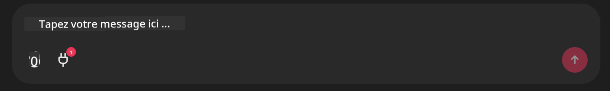

<!--
CO_OP_TRANSLATOR_METADATA:
{
  "original_hash": "393eea8000f305b94010dd5b380902d8",
  "translation_date": "2025-05-20T10:01:45+00:00",
  "source_file": "11-mcp/code_samples/github-mcp/README.md",
  "language_code": "fr"
}
-->
# Exemple de serveur Github MCP

## Description

Ceci est une démo créée pour le Hackathon AI Agents organisé via le Microsoft Reactor.

Cet outil est utilisé pour recommander des projets de hackathon basés sur les dépôts Github d’un utilisateur.  
Cela fonctionne de la manière suivante :

1. **Github Agent** - Utilise le serveur Github MCP pour récupérer les dépôts et les informations à leur sujet.  
2. **Hackathon Agent** - Prend les données du Github Agent et génère des idées créatives de projets de hackathon basées sur les projets, les langages utilisés par l’utilisateur et les thématiques du hackathon AI Agents.  
3. **Events Agent** - En se basant sur les suggestions du hackathon agent, l’events agent recommande des événements pertinents issus de la série AI Agent Hackathon.  

## Exécution du code

### Variables d’environnement

Cette démo utilise Azure Open AI Service, Semantic Kernel, le serveur Github MCP et Azure AI Search.

Assurez-vous d’avoir défini les bonnes variables d’environnement pour utiliser ces outils :

```python
AZURE_OPENAI_CHAT_DEPLOYMENT_NAME=""
AZURE_OPENAI_EMBEDDING_DEPLOYMENT_NAME=""
AZURE_OPENAI_ENDPOINT=""
AZURE_OPENAI_API_KEY=""
AZURE_OPENAI_API_VERSION=""
AZURE_SEARCH_SERVICE_ENDPOINT=""
AZURE_SEARCH_API_KEY=""
```

## Lancer le serveur Chainlit

Pour se connecter au serveur MCP, cette démo utilise Chainlit comme interface de chat.

Pour lancer le serveur, utilisez la commande suivante dans votre terminal :

```bash
chainlit run app.py -w
```

Cela devrait démarrer votre serveur Chainlit sur `localhost:8000` as well as populate your Azure AI Search Index with the `event-descriptions.md` content.

## Connexion au serveur MCP

Pour vous connecter au serveur Github MCP, sélectionnez l’icône « prise » sous la zone de saisie « Tapez votre message ici… » :



Vous pouvez ensuite cliquer sur « Connect an MCP » pour ajouter la commande permettant de vous connecter au serveur Github MCP :

```bash
npx -y @modelcontextprotocol/server-github --env GITHUB_PERSONAL_ACCESS_TOKEN=[YOUR PERSONAL ACCESS TOKEN]
```

Remplacez « [YOUR PERSONAL ACCESS TOKEN] » par votre vrai Personal Access Token.

Après la connexion, vous devriez voir un (1) à côté de l’icône prise pour confirmer la connexion. Sinon, essayez de redémarrer le serveur chainlit avec `chainlit run app.py -w`.

## Utilisation de la démo

Pour lancer le workflow de recommandation de projets de hackathon, vous pouvez taper un message comme :

« Recommande des projets de hackathon pour l’utilisateur Github koreyspace »

**Pour l’instant, le code détecte les mots « reccomend » et « github » pour démarrer ce workflow. Plus tard, ce sera géré par un Router Agent.**

**Avertissement** :  
Ce document a été traduit à l'aide du service de traduction automatique [Co-op Translator](https://github.com/Azure/co-op-translator). Bien que nous nous efforçons d'assurer l'exactitude, veuillez noter que les traductions automatiques peuvent contenir des erreurs ou des inexactitudes. Le document original dans sa langue native doit être considéré comme la source faisant foi. Pour les informations critiques, une traduction professionnelle humaine est recommandée. Nous déclinons toute responsabilité en cas de malentendus ou de mauvaises interprétations résultant de l'utilisation de cette traduction.