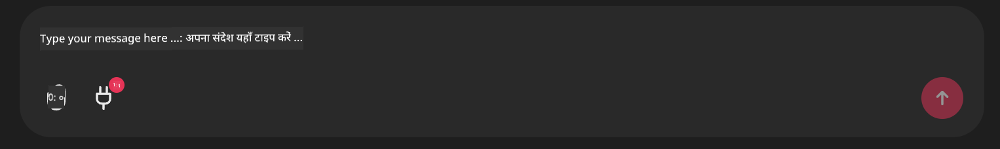

<!--
CO_OP_TRANSLATOR_METADATA:
{
  "original_hash": "393eea8000f305b94010dd5b380902d8",
  "translation_date": "2025-05-20T10:03:14+00:00",
  "source_file": "11-mcp/code_samples/github-mcp/README.md",
  "language_code": "hi"
}
-->
# Github MCP सर्वर उदाहरण

## विवरण

यह एक डेमो था जो Microsoft Reactor के माध्यम से आयोजित AI Agents Hackathon के लिए बनाया गया था।

यह टूल उपयोगकर्ता के Github रिपोज के आधार पर हैकाथॉन प्रोजेक्ट्स की सिफारिश करने के लिए इस्तेमाल होता है।  
यह इस तरह काम करता है:

1. **Github Agent** - Github MCP सर्वर का उपयोग करके रिपोज और उनकी जानकारी प्राप्त करता है।  
2. **Hackathon Agent** - Github Agent से मिली जानकारी लेकर, उपयोगकर्ता द्वारा उपयोग की गई भाषाओं और AI Agents hackathon के प्रोजेक्ट ट्रैक्स के आधार पर रचनात्मक हैकाथॉन प्रोजेक्ट आइडियाज तैयार करता है।  
3. **Events Agent** - Hackathon Agent की सिफारिशों के आधार पर, Events Agent AI Agent Hackathon सीरीज के संबंधित इवेंट्स की सिफारिश करता है।  

## कोड चलाना

### पर्यावरण वेरिएबल्स

यह डेमो Azure Open AI Service, Semantic Kernel, Github MCP Server और Azure AI Search का उपयोग करता है।

सुनिश्चित करें कि इन टूल्स का उपयोग करने के लिए आपके पास उचित पर्यावरण वेरिएबल्स सेट हैं:

```python
AZURE_OPENAI_CHAT_DEPLOYMENT_NAME=""
AZURE_OPENAI_EMBEDDING_DEPLOYMENT_NAME=""
AZURE_OPENAI_ENDPOINT=""
AZURE_OPENAI_API_KEY=""
AZURE_OPENAI_API_VERSION=""
AZURE_SEARCH_SERVICE_ENDPOINT=""
AZURE_SEARCH_API_KEY=""
``` 

## Chainlit सर्वर चलाना

MCP सर्वर से कनेक्ट होने के लिए, यह डेमो Chainlit को चैट इंटरफेस के रूप में उपयोग करता है।

सर्वर चलाने के लिए, अपने टर्मिनल में निम्न कमांड का उपयोग करें:

```bash
chainlit run app.py -w
```

इससे आपका Chainlit सर्वर `localhost:8000` as well as populate your Azure AI Search Index with the `event-descriptions.md` कंटेंट पर शुरू हो जाएगा।

## MCP सर्वर से कनेक्ट करना

Github MCP सर्वर से कनेक्ट होने के लिए, "Type your message here.." चैट बॉक्स के नीचे "plug" आइकन चुनें:



वहाँ से आप "Connect an MCP" पर क्लिक करके Github MCP Server से कनेक्ट करने का कमांड जोड़ सकते हैं:

```bash
npx -y @modelcontextprotocol/server-github --env GITHUB_PERSONAL_ACCESS_TOKEN=[YOUR PERSONAL ACCESS TOKEN]
```

"[YOUR PERSONAL ACCESS TOKEN]" को अपने असली Personal Access Token से बदलें।

कनेक्ट होने के बाद, प्लग आइकन के पास (1) दिखना चाहिए जो कनेक्शन की पुष्टि करता है। यदि नहीं दिखे, तो `chainlit run app.py -w` कमांड से chainlit सर्वर को पुनः शुरू करने का प्रयास करें।

## डेमो का उपयोग

हैकाथॉन प्रोजेक्ट्स की सिफारिश करने के एजेंट वर्कफ़्लो शुरू करने के लिए, आप इस तरह का संदेश टाइप कर सकते हैं:

"Recommend hackathon projects for the Github user koreyspace"

**फिलहाल, हमने इसे इस तरह कोड किया है कि यह "reccomend" और "github" शब्दों को पहचान कर यह वर्कफ़्लो शुरू करता है। भविष्य में, यह Router Agent द्वारा किया जाएगा।**

**अस्वीकरण**:  
यह दस्तावेज़ AI अनुवाद सेवा [Co-op Translator](https://github.com/Azure/co-op-translator) का उपयोग करके अनुवादित किया गया है। जबकि हम सटीकता के लिए प्रयासरत हैं, कृपया ध्यान रखें कि स्वचालित अनुवादों में त्रुटियाँ या गलतियाँ हो सकती हैं। मूल दस्तावेज़ अपनी मूल भाषा में ही प्रामाणिक स्रोत माना जाना चाहिए। महत्वपूर्ण जानकारी के लिए, पेशेवर मानव अनुवाद की सिफारिश की जाती है। इस अनुवाद के उपयोग से उत्पन्न किसी भी गलतफहमी या गलत व्याख्या के लिए हम जिम्मेदार नहीं हैं।