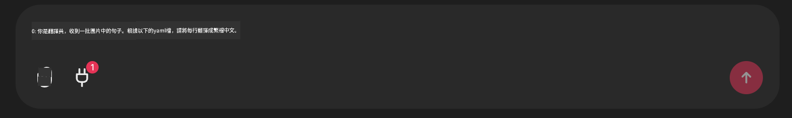

<!--
CO_OP_TRANSLATOR_METADATA:
{
  "original_hash": "393eea8000f305b94010dd5b380902d8",
  "translation_date": "2025-05-20T10:01:35+00:00",
  "source_file": "11-mcp/code_samples/github-mcp/README.md",
  "language_code": "hk"
}
-->
# Github MCP Server 範例

## 描述

這是一個為 Microsoft Reactor 舉辦的 AI Agents Hackathon 所製作的示範。

這個工具用來根據用戶的 Github 倉庫推薦 hackathon 項目。
流程如下：

1. **Github Agent** - 使用 Github MCP Server 取得倉庫及相關資料。
2. **Hackathon Agent** - 根據 Github Agent 提供的資料，結合用戶使用的程式語言和 AI Agents hackathon 的項目分類，提出有創意的 hackathon 項目點子。
3. **Events Agent** - 根據 hackathon agent 的建議，推薦 AI Agent Hackathon 系列中相關的活動。

## 執行程式碼

### 環境變數

這個示範使用 Azure Open AI Service、Semantic Kernel、Github MCP Server 以及 Azure AI Search。

請確保你已設定好正確的環境變數以使用這些工具：

```python
AZURE_OPENAI_CHAT_DEPLOYMENT_NAME=""
AZURE_OPENAI_EMBEDDING_DEPLOYMENT_NAME=""
AZURE_OPENAI_ENDPOINT=""
AZURE_OPENAI_API_KEY=""
AZURE_OPENAI_API_VERSION=""
AZURE_SEARCH_SERVICE_ENDPOINT=""
AZURE_SEARCH_API_KEY=""
``` 

## 啟動 Chainlit Server

為了連接 MCP server，這個示範使用 Chainlit 作為聊天介面。

在終端機輸入以下指令來啟動伺服器：

```bash
chainlit run app.py -w
```

這樣就會在 `localhost:8000` as well as populate your Azure AI Search Index with the `event-descriptions.md` 啟動你的 Chainlit server。

## 連接 MCP Server

要連接 Github MCP Server，請點擊「Type your message here..」聊天框下方的「plug」圖示：



接著點選「Connect an MCP」來新增連接 Github MCP Server 的指令：

```bash
npx -y @modelcontextprotocol/server-github --env GITHUB_PERSONAL_ACCESS_TOKEN=[YOUR PERSONAL ACCESS TOKEN]
```

將 "[YOUR PERSONAL ACCESS TOKEN]" 替換成你的個人存取令牌。

連接成功後，plug 圖示旁會顯示 (1) 以確認已連線。若沒有，請嘗試用 `chainlit run app.py -w` 重新啟動 chainlit server。

## 使用示範

要開始推薦 hackathon 項目的代理工作流程，你可以輸入類似以下訊息：

"Recommend hackathon projects for the Github user koreyspace"

**目前我們是用偵測「reccomend」和「github」這兩個關鍵字來啟動這個流程。未來會改由 Router Agent 來處理。**

**免責聲明**：  
本文件係使用 AI 翻譯服務 [Co-op Translator](https://github.com/Azure/co-op-translator) 翻譯而成。雖然我哋致力確保準確性，但請注意，自動翻譯可能包含錯誤或不準確之處。原始文件嘅母語版本應被視為權威來源。對於重要資料，建議採用專業人工翻譯。我哋對因使用此翻譯而引起嘅任何誤解或誤釋概不負責。