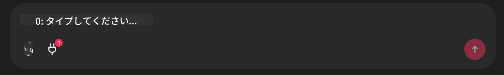

<!--
CO_OP_TRANSLATOR_METADATA:
{
  "original_hash": "393eea8000f305b94010dd5b380902d8",
  "translation_date": "2025-05-20T10:01:56+00:00",
  "source_file": "11-mcp/code_samples/github-mcp/README.md",
  "language_code": "ja"
}
-->
# Github MCP サーバーの例

## 説明

これは、Microsoft Reactorで開催されたAIエージェントハッカソンのために作成されたデモです。

このツールは、ユーザーのGithubリポジトリに基づいてハッカソンプロジェクトを推薦します。  
その方法は以下の通りです：

1. **Github Agent** - Github MCPサーバーを使ってリポジトリとその情報を取得します。  
2. **Hackathon Agent** - Github Agentから得たデータを元に、ユーザーのプロジェクトや使用言語、AIエージェントハッカソンのプロジェクトトラックに基づいて創造的なハッカソンプロジェクトのアイデアを考えます。  
3. **Events Agent** - Hackathon Agentの提案に基づき、AIエージェントハッカソンシリーズの関連イベントを推薦します。

## コードの実行

### 環境変数

このデモでは、Azure Open AI Service、Semantic Kernel、Github MCPサーバー、Azure AI Searchを使用しています。

これらのツールを利用するために、適切な環境変数が設定されていることを確認してください：

```python
AZURE_OPENAI_CHAT_DEPLOYMENT_NAME=""
AZURE_OPENAI_EMBEDDING_DEPLOYMENT_NAME=""
AZURE_OPENAI_ENDPOINT=""
AZURE_OPENAI_API_KEY=""
AZURE_OPENAI_API_VERSION=""
AZURE_SEARCH_SERVICE_ENDPOINT=""
AZURE_SEARCH_API_KEY=""
```

## Chainlitサーバーの起動

MCPサーバーに接続するために、このデモではChainlitをチャットインターフェースとして使用しています。

サーバーを起動するには、ターミナルで以下のコマンドを実行してください：

```bash
chainlit run app.py -w
```

これで`localhost:8000` as well as populate your Azure AI Search Index with the `event-descriptions.md`でChainlitサーバーが起動します。

## MCPサーバーへの接続

Github MCPサーバーに接続するには、「Type your message here..」チャットボックスの下にある「プラグ」アイコンを選択してください：



そこから「Connect an MCP」をクリックして、Github MCPサーバーに接続するコマンドを追加できます：

```bash
npx -y @modelcontextprotocol/server-github --env GITHUB_PERSONAL_ACCESS_TOKEN=[YOUR PERSONAL ACCESS TOKEN]
```

"[YOUR PERSONAL ACCESS TOKEN]"は実際のPersonal Access Tokenに置き換えてください。

接続が成功すると、プラグアイコンの隣に(1)が表示されます。表示されない場合は、`chainlit run app.py -w`でChainlitサーバーを再起動してみてください。

## デモの使用方法

ハッカソンプロジェクトを推薦するエージェントのワークフローを開始するには、以下のようなメッセージを入力してください：

"Recommend hackathon projects for the Github user koreyspace"

**現在は「reccomend」と「github」という単語を検出するとこのワークフローを開始するようにコードされています。今後はRouter Agentによって処理される予定です。**

**免責事項**：  
本書類はAI翻訳サービス「Co-op Translator」（https://github.com/Azure/co-op-translator）を使用して翻訳されました。正確性を期しておりますが、自動翻訳には誤りや不正確な部分が含まれる可能性があることをご承知ください。原文の言語によるオリジナル文書が正式な情報源とみなされます。重要な情報については、専門の人間による翻訳を推奨いたします。本翻訳の利用により生じた誤解や解釈の相違について、当方は一切の責任を負いかねます。