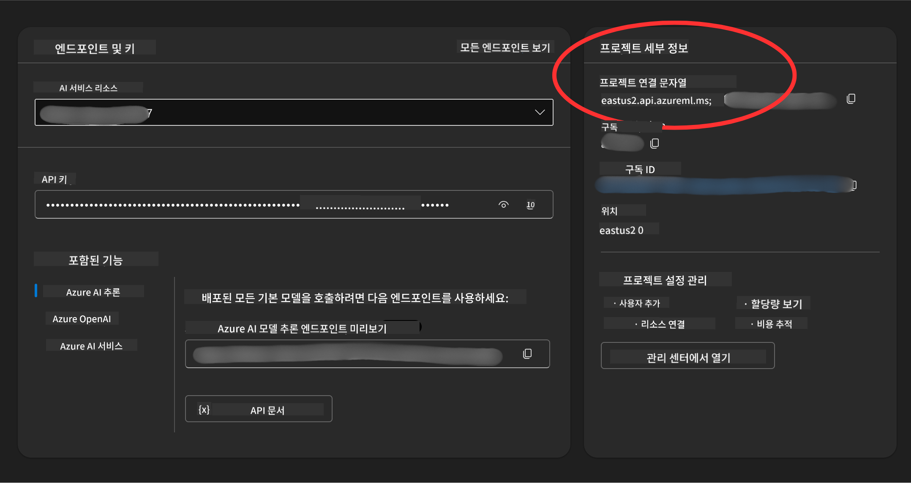

<!--
CO_OP_TRANSLATOR_METADATA:
{
  "original_hash": "49fa13c21a816ffcc7740ab17ba024a9",
  "translation_date": "2025-05-20T08:32:32+00:00",
  "source_file": "00-course-setup/README.md",
  "language_code": "ko"
}
-->
이제 다음 링크에서 이 코스의 포크된 버전을 가지고 있을 것입니다:


## 코드 실행하기

이 코스는 AI 에이전트를 직접 만들어보는 실습을 할 수 있는 일련의 Jupyter 노트북을 제공합니다.

코드 샘플은 다음 중 하나를 사용합니다:

**GitHub 계정 필요 - 무료**:

1) Semantic Kernel 에이전트 프레임워크 + GitHub 모델 마켓플레이스. (semantic-kernel.ipynb)
2) AutoGen 프레임워크 + GitHub 모델 마켓플레이스. (autogen.ipynb)

**Azure 구독 필요**:
3) Azure AI Foundry + Azure AI 에이전트 서비스. (azureaiagent.ipynb)

세 가지 예제를 모두 시도해 보면서 자신에게 가장 적합한 것을 찾아보길 권장합니다.

어떤 옵션을 선택하느냐에 따라 아래의 설정 단계를 따라야 합니다:

## 요구 사항

- Python 3.12 이상
- GitHub 계정 - GitHub 모델 마켓플레이스 접근용
- Azure 구독 - Azure AI Foundry 접근용
- Azure AI Foundry 계정 - Azure AI 에이전트 서비스 접근용

이 저장소 루트에 코드 샘플 실행에 필요한 모든 Python 패키지를 명시한 `requirements.txt` 파일이 포함되어 있습니다.

터미널에서 저장소 루트 위치로 가서 다음 명령어로 설치할 수 있습니다:

```bash
pip install -r requirements.txt
```
충돌이나 문제를 방지하기 위해 Python 가상 환경을 만드는 것을 권장합니다.

## GitHub 모델 사용 샘플 설정

### 1단계: GitHub 개인 액세스 토큰(PAT) 받기

현재 이 코스는 GitHub 모델 마켓플레이스를 이용해 AI 에이전트 생성에 사용할 대형 언어 모델(LLM)에 무료로 접근할 수 있도록 합니다.

이 서비스를 사용하려면 GitHub 개인 액세스 토큰을 만들어야 합니다.

GitHub 계정에서 다음을 선택하세요: `Fine-grained tokens` option on the left side of your screen.

Then select `Generate new token`.


You will be prompted to enter a name for your token, select the expiration date (Recommended: 30 Days), and select the scopes for your token (Public Repositories).

Copy your new token that you have just created. You will now add this to your `.env` file included in this course. 


### Step 2: Create Your `.env` File

To create your `.env` 파일에서 터미널에 다음 명령어를 실행하세요.

```bash
cp .env.example .env
```

이 명령어는 예제 파일을 복사하여 `.env` in your directory and where you fill in the values for the environment variables.

With your token copied, open the `.env` file in your favorite text editor and paste your token into the `GITHUB_TOKEN` field.

You should now be able to run the code samples of this course.

## Set Up for Samples using Azure AI Foundry and Azure AI Agent Service

### Step 1: Retrieve Your Azure Project Connection String

Follow the steps to creating a project and agent in Azure AI Foundry found here: [Create a project in Azure AI Foundry](https://learn.microsoft.com/en-us/azure/ai-services/agents/quickstart?pivots=ai-foundry-portal?WT.mc_id=academic-105485-koreyst)

Once you have created your project, you will need to retrieve the connection string for your project.

This can be done by going to the **Overview** page of your project in the Azure AI Foundry portal.



### Step 2: Create Your `.env` File

To create your `.env` 파일을 생성합니다. 터미널에서 다음 명령어를 실행하세요.

```bash
cp .env.example .env
```

이 명령어는 예제 파일을 복사하여 `.env` in your directory and where you fill in the values for the environment variables.

With your token copied, open the `.env` file in your favorite text editor and paste your token into the `PROJECT_CONNECTION_STRING` field.

### Step 3: Sign in to Azure

As a security best practice, we'll use [keyless authentication](https://learn.microsoft.com/azure/developer/ai/keyless-connections?tabs=csharp%2Cazure-cli?WT.mc_id=academic-105485-koreyst) to authenticate to Azure OpenAI with Microsoft Entra ID. Before you can do so, you'll first need to install the **Azure CLI** per the [installation instructions](https://learn.microsoft.com/cli/azure/install-azure-cli?WT.mc_id=academic-105485-koreyst) for your operating system.

Next, open a terminal and run `az login --use-device-code` to sign in to your Azure account.

Once you've logged in, select your subscription in the terminal.


## Additional Envionment Variables - Azure Search and Azure OpenAI 

For the Agentic RAG Lesson - Lesson 5 - there are samples that use Azure Search and Azure OpenAI.

If you want to run these samples, you will need to add the following environment variables to your `.env` file:

### Overview Page (Project)

- `AZURE_SUBSCRIPTION_ID` - Check **Project details** on the **Overview** page of your project.

- `AZURE_AI_PROJECT_NAME` - Look at the top of the **Overview** page for your project.

- `AZURE_OPENAI_SERVICE` - Find this in the **Included capabilities** tab for **Azure OpenAI Service** on the **Overview** page.

### Management Center

- `AZURE_OPENAI_RESOURCE_GROUP` - Go to **Project properties** on the **Overview** page of the **Management Center**.

- `GLOBAL_LLM_SERVICE` - Under **Connected resources**, find the **Azure AI Services** connection name. If not listed, check the **Azure portal** under your resource group for the AI Services resource name.

### Models + Endpoints Page

- `AZURE_OPENAI_EMBEDDING_DEPLOYMENT_NAME` - Select your embedding model (e.g., `text-embedding-ada-002`) and note the **Deployment name** from the model details.

- `AZURE_OPENAI_CHAT_DEPLOYMENT_NAME` - Select your chat model (e.g., `gpt-4o-mini`) and note the **Deployment name** from the model details.

### Azure Portal

- `AZURE_OPENAI_ENDPOINT` - Look for **Azure AI services**, click on it, then go to **Resource Management**, **Keys and Endpoint**, scroll down to the "Azure OpenAI endpoints", and copy the one that says "Language APIs".

- `AZURE_OPENAI_API_KEY` - From the same screen, copy KEY 1 or KEY 2.

- `AZURE_SEARCH_SERVICE_ENDPOINT` - Find your **Azure AI Search** resource, click it, and see **Overview**.

- `AZURE_SEARCH_API_KEY` - Then go to **Settings** and then **Keys** to copy the primary or secondary admin key.

### External Webpage

- `AZURE_OPENAI_API_VERSION` - Visit the [API version lifecycle](https://learn.microsoft.com/en-us/azure/ai-services/openai/api-version-deprecation#latest-ga-api-release) page under **Latest GA API release**.

### Setup keyless authentication

Rather than hardcode your credentials, we'll use a keyless connection with Azure OpenAI. To do so, we'll import `DefaultAzureCredential` and later call the `DefaultAzureCredential` 함수를 사용해 자격 증명을 얻습니다.

```python
from azure.identity import DefaultAzureCredential, InteractiveBrowserCredential
```

## 진행이 막혔나요?

설정 과정에서 문제가 있다면 언제든지 우리 커뮤니티에 참여하세요

또는

.

## 다음 강의

이제 이 코스의 코드를 실행할 준비가 되었습니다. AI 에이전트의 세계에 대해 더 배우는 즐거운 시간이 되길 바랍니다!

[AI 에이전트 소개 및 에이전트 활용 사례](../01-intro-to-ai-agents/README.md)

**면책 조항**:  
이 문서는 AI 번역 서비스 [Co-op Translator](https://github.com/Azure/co-op-translator)를 사용하여 번역되었습니다. 정확성을 위해 노력하고 있으나, 자동 번역에는 오류나 부정확성이 포함될 수 있음을 유의하시기 바랍니다. 원문은 해당 언어의 원본 문서가 권위 있는 출처로 간주되어야 합니다. 중요한 정보의 경우, 전문적인 인간 번역을 권장합니다. 본 번역 사용으로 인한 오해나 잘못된 해석에 대해서는 당사가 책임지지 않습니다.