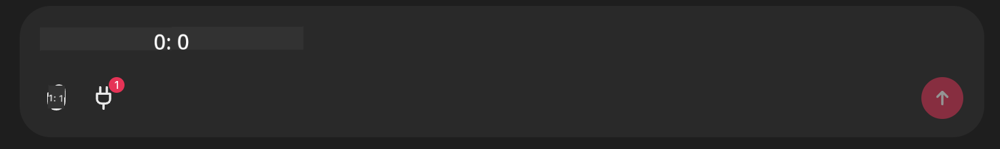

<!--
CO_OP_TRANSLATOR_METADATA:
{
  "original_hash": "393eea8000f305b94010dd5b380902d8",
  "translation_date": "2025-05-20T10:03:05+00:00",
  "source_file": "11-mcp/code_samples/github-mcp/README.md",
  "language_code": "pl"
}
-->
# Github MCP Server Przykład

## Opis

To była prezentacja stworzona na AI Agents Hackathon organizowany przez Microsoft Reactor.

Narzędzie służy do rekomendowania projektów hackathonowych na podstawie repozytoriów użytkownika na Githubie.  
Dzieje się to poprzez:

1. **Github Agent** – korzystanie z Github MCP Server do pobierania repozytoriów i informacji o nich.  
2. **Hackathon Agent** – przetwarza dane od Github Agenta i generuje kreatywne pomysły na projekty hackathonowe bazując na projektach, językach używanych przez użytkownika oraz ścieżkach projektów AI Agents hackathonu.  
3. **Events Agent** – na podstawie sugestii Hackathon Agenta, Events Agent poleca odpowiednie wydarzenia z serii AI Agent Hackathon.  

## Uruchamianie kodu

### Zmienne środowiskowe

Ta prezentacja korzysta z Azure Open AI Service, Semantic Kernel, Github MCP Server oraz Azure AI Search.

Upewnij się, że masz poprawnie ustawione zmienne środowiskowe potrzebne do korzystania z tych narzędzi:

```python
AZURE_OPENAI_CHAT_DEPLOYMENT_NAME=""
AZURE_OPENAI_EMBEDDING_DEPLOYMENT_NAME=""
AZURE_OPENAI_ENDPOINT=""
AZURE_OPENAI_API_KEY=""
AZURE_OPENAI_API_VERSION=""
AZURE_SEARCH_SERVICE_ENDPOINT=""
AZURE_SEARCH_API_KEY=""
```

## Uruchamianie Chainlit Server

Aby połączyć się z MCP serverem, ta prezentacja używa Chainlit jako interfejsu czatu.

Aby uruchomić serwer, użyj następującego polecenia w terminalu:

```bash
chainlit run app.py -w
```

To powinno uruchomić Twój serwer Chainlit na `localhost:8000` as well as populate your Azure AI Search Index with the `event-descriptions.md`.

## Łączenie się z MCP Server

Aby połączyć się z Github MCP Server, wybierz ikonę „wtyczki” pod polem czatu „Type your message here..”:



Następnie kliknij „Connect an MCP”, aby dodać polecenie łączące z Github MCP Server:

```bash
npx -y @modelcontextprotocol/server-github --env GITHUB_PERSONAL_ACCESS_TOKEN=[YOUR PERSONAL ACCESS TOKEN]
```

Zamień "[YOUR PERSONAL ACCESS TOKEN]" na swój rzeczywisty Personal Access Token.

Po połączeniu powinieneś zobaczyć (1) obok ikony wtyczki, co potwierdza połączenie. Jeśli nie, spróbuj ponownie uruchomić serwer chainlit poleceniem `chainlit run app.py -w`.

## Korzystanie z prezentacji

Aby rozpocząć pracę agenta rekomendującego projekty hackathonowe, możesz wpisać wiadomość w stylu:

"Recommend hackathon projects for the Github user koreyspace"

**Obecnie mamy zakodowane wykrywanie słów „reccomend” i „github” do uruchomienia tego procesu. W przyszłości będzie to realizowane przez Router Agent.**

**Zastrzeżenie**:  
Niniejszy dokument został przetłumaczony za pomocą usługi tłumaczenia AI [Co-op Translator](https://github.com/Azure/co-op-translator). Mimo że dążymy do jak największej dokładności, prosimy pamiętać, że tłumaczenia automatyczne mogą zawierać błędy lub nieścisłości. Oryginalny dokument w języku źródłowym powinien być uważany za źródło wiarygodne. W przypadku informacji krytycznych zaleca się skorzystanie z profesjonalnego tłumaczenia wykonanego przez człowieka. Nie ponosimy odpowiedzialności za jakiekolwiek nieporozumienia lub błędne interpretacje wynikające z korzystania z tego tłumaczenia.