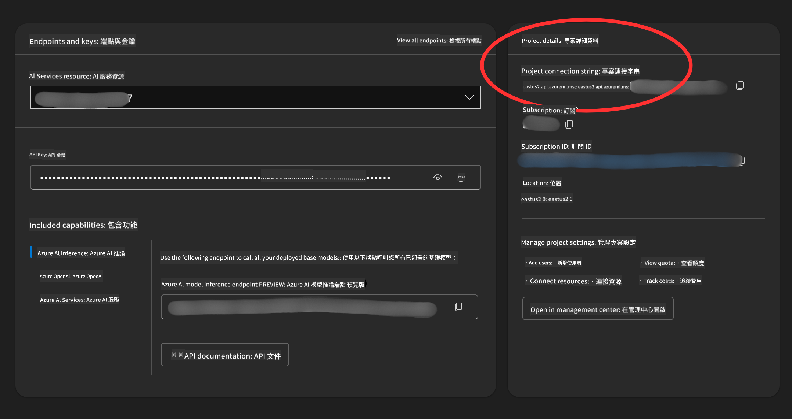

<!--
CO_OP_TRANSLATOR_METADATA:
{
  "original_hash": "49fa13c21a816ffcc7740ab17ba024a9",
  "translation_date": "2025-05-20T07:22:20+00:00",
  "source_file": "00-course-setup/README.md",
  "language_code": "tw"
}
-->
你現在應該擁有這門課程的分支版本，連結如下：


## 執行程式碼

這門課程提供一系列 Jupyter 筆記本，讓你可以親手操作，體驗建構 AI 代理的過程。

程式碼範例使用以下其中一種：

**需要 GitHub 帳號 - 免費**：

1) Semantic Kernel Agent Framework + GitHub Models Marketplace。標記為 (semantic-kernel.ipynb)
2) AutoGen Framework + GitHub Models Marketplace。標記為 (autogen.ipynb)

**需要 Azure 訂閱**：
3) Azure AI Foundry + Azure AI Agent Service。標記為 (azureaiagent.ipynb)

我們鼓勵你嘗試這三種範例，看看哪一種最適合你。

你選擇的方案會決定你接下來需要遵循的設定步驟：

## 需求

- Python 3.12 以上
- GitHub 帳號 - 用於存取 GitHub Models Marketplace
- Azure 訂閱 - 用於存取 Azure AI Foundry
- Azure AI Foundry 帳號 - 用於存取 Azure AI Agent Service

我們在這個資料庫根目錄放了一個 `requirements.txt` 檔案，裡面包含執行程式碼範例所需的所有 Python 套件。

你可以在資料庫根目錄的終端機執行以下指令來安裝：

```bash
pip install -r requirements.txt
```

建議你建立 Python 虛擬環境，避免發生衝突或其他問題。

## 使用 GitHub Models 的範例設定

### 步驟 1：取得你的 GitHub Personal Access Token (PAT)

目前這門課程使用 GitHub Models Marketplace，提供免費的巨大語言模型（LLMs）來建立 AI 代理。

要使用此服務，你需要建立一個 GitHub Personal Access Token。

這可以在你的 GitHub 帳號中完成。

選擇 `Fine-grained tokens` option on the left side of your screen.

Then select `Generate new token`.


You will be prompted to enter a name for your token, select the expiration date (Recommended: 30 Days), and select the scopes for your token (Public Repositories).

Copy your new token that you have just created. You will now add this to your `.env` file included in this course. 


### Step 2: Create Your `.env` File

To create your `.env` 檔案後，在終端機執行以下指令：

```bash
cp .env.example .env
```

這會複製範例檔案並建立一個 `.env` in your directory and where you fill in the values for the environment variables.

With your token copied, open the `.env` file in your favorite text editor and paste your token into the `GITHUB_TOKEN` field.

You should now be able to run the code samples of this course.

## Set Up for Samples using Azure AI Foundry and Azure AI Agent Service

### Step 1: Retrieve Your Azure Project Connection String

Follow the steps to creating a project and agent in Azure AI Foundry found here: [Create a project in Azure AI Foundry](https://learn.microsoft.com/en-us/azure/ai-services/agents/quickstart?pivots=ai-foundry-portal?WT.mc_id=academic-105485-koreyst)

Once you have created your project, you will need to retrieve the connection string for your project.

This can be done by going to the **Overview** page of your project in the Azure AI Foundry portal.



### Step 2: Create Your `.env` File

To create your `.env` 檔案，在終端機執行以下指令：

```bash
cp .env.example .env
```

這會複製範例檔案並建立一個 `.env` in your directory and where you fill in the values for the environment variables.

With your token copied, open the `.env` file in your favorite text editor and paste your token into the `PROJECT_CONNECTION_STRING` field.

### Step 3: Sign in to Azure

As a security best practice, we'll use [keyless authentication](https://learn.microsoft.com/azure/developer/ai/keyless-connections?tabs=csharp%2Cazure-cli?WT.mc_id=academic-105485-koreyst) to authenticate to Azure OpenAI with Microsoft Entra ID. Before you can do so, you'll first need to install the **Azure CLI** per the [installation instructions](https://learn.microsoft.com/cli/azure/install-azure-cli?WT.mc_id=academic-105485-koreyst) for your operating system.

Next, open a terminal and run `az login --use-device-code` to sign in to your Azure account.

Once you've logged in, select your subscription in the terminal.


## Additional Envionment Variables - Azure Search and Azure OpenAI 

For the Agentic RAG Lesson - Lesson 5 - there are samples that use Azure Search and Azure OpenAI.

If you want to run these samples, you will need to add the following environment variables to your `.env` file:

### Overview Page (Project)

- `AZURE_SUBSCRIPTION_ID` - Check **Project details** on the **Overview** page of your project.

- `AZURE_AI_PROJECT_NAME` - Look at the top of the **Overview** page for your project.

- `AZURE_OPENAI_SERVICE` - Find this in the **Included capabilities** tab for **Azure OpenAI Service** on the **Overview** page.

### Management Center

- `AZURE_OPENAI_RESOURCE_GROUP` - Go to **Project properties** on the **Overview** page of the **Management Center**.

- `GLOBAL_LLM_SERVICE` - Under **Connected resources**, find the **Azure AI Services** connection name. If not listed, check the **Azure portal** under your resource group for the AI Services resource name.

### Models + Endpoints Page

- `AZURE_OPENAI_EMBEDDING_DEPLOYMENT_NAME` - Select your embedding model (e.g., `text-embedding-ada-002`) and note the **Deployment name** from the model details.

- `AZURE_OPENAI_CHAT_DEPLOYMENT_NAME` - Select your chat model (e.g., `gpt-4o-mini`) and note the **Deployment name** from the model details.

### Azure Portal

- `AZURE_OPENAI_ENDPOINT` - Look for **Azure AI services**, click on it, then go to **Resource Management**, **Keys and Endpoint**, scroll down to the "Azure OpenAI endpoints", and copy the one that says "Language APIs".

- `AZURE_OPENAI_API_KEY` - From the same screen, copy KEY 1 or KEY 2.

- `AZURE_SEARCH_SERVICE_ENDPOINT` - Find your **Azure AI Search** resource, click it, and see **Overview**.

- `AZURE_SEARCH_API_KEY` - Then go to **Settings** and then **Keys** to copy the primary or secondary admin key.

### External Webpage

- `AZURE_OPENAI_API_VERSION` - Visit the [API version lifecycle](https://learn.microsoft.com/en-us/azure/ai-services/openai/api-version-deprecation#latest-ga-api-release) page under **Latest GA API release**.

### Setup keyless authentication

Rather than hardcode your credentials, we'll use a keyless connection with Azure OpenAI. To do so, we'll import `DefaultAzureCredential` and later call the `DefaultAzureCredential` 函式來取得憑證。

```python
from azure.identity import DefaultAzureCredential, InteractiveBrowserCredential
```

## 卡住了嗎？

如果在設定過程中遇到任何問題，歡迎加入我們的

或

。

## 下一課

你現在已經準備好執行這門課程的程式碼了，祝你在 AI 代理的世界裡學習愉快！

[Introduction to AI Agents and Agent Use Cases](../01-intro-to-ai-agents/README.md)

**免責聲明**：  
本文件係使用 AI 翻譯服務 [Co-op Translator](https://github.com/Azure/co-op-translator) 進行翻譯。雖然我們致力於確保準確性，但請注意自動翻譯可能包含錯誤或不精確之處。原始文件之母語版本應視為權威來源。對於重要資訊，建議採用專業人工翻譯。我們不對因使用本翻譯所產生之任何誤解或誤釋負責。