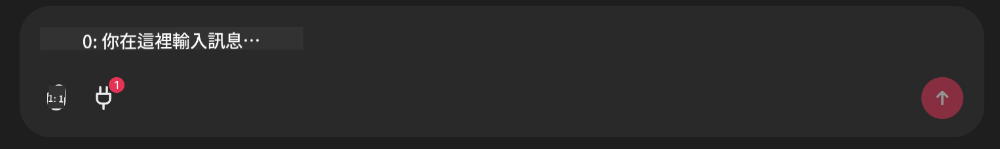

<!--
CO_OP_TRANSLATOR_METADATA:
{
  "original_hash": "393eea8000f305b94010dd5b380902d8",
  "translation_date": "2025-05-20T10:01:26+00:00",
  "source_file": "11-mcp/code_samples/github-mcp/README.md",
  "language_code": "tw"
}
-->
# Github MCP Server 範例

## 說明

這是為 Microsoft Reactor 舉辦的 AI Agents 黑客松所製作的示範。

這個工具用來根據使用者的 Github 倉庫推薦黑客松專案。
流程如下：

1. **Github Agent** - 使用 Github MCP Server 取得倉庫及相關資訊。
2. **Hackathon Agent** - 利用 Github Agent 的資料，根據使用者的專案、程式語言以及 AI Agents 黑客松的專案主題，提出有創意的黑客松專案點子。
3. **Events Agent** - 根據 Hackathon Agent 的建議，推薦 AI Agent 黑客松系列的相關活動。

## 執行程式碼

### 環境變數

這個示範使用 Azure Open AI Service、Semantic Kernel、Github MCP Server 以及 Azure AI Search。

請確認你已設定好使用這些工具所需的環境變數：

```python
AZURE_OPENAI_CHAT_DEPLOYMENT_NAME=""
AZURE_OPENAI_EMBEDDING_DEPLOYMENT_NAME=""
AZURE_OPENAI_ENDPOINT=""
AZURE_OPENAI_API_KEY=""
AZURE_OPENAI_API_VERSION=""
AZURE_SEARCH_SERVICE_ENDPOINT=""
AZURE_SEARCH_API_KEY=""
```

## 執行 Chainlit Server

此示範使用 Chainlit 作為聊天介面來連接 MCP server。

在終端機輸入以下指令啟動伺服器：

```bash
chainlit run app.py -w
```

這會在 `localhost:8000` as well as populate your Azure AI Search Index with the `event-descriptions.md` 啟動你的 Chainlit 伺服器。

## 連接 MCP Server

要連接 Github MCP Server，請點選「Type your message here..」聊天框下方的「plug」圖示：



接著點選「Connect an MCP」來新增連接 Github MCP Server 的指令：

```bash
npx -y @modelcontextprotocol/server-github --env GITHUB_PERSONAL_ACCESS_TOKEN=[YOUR PERSONAL ACCESS TOKEN]
```

將 "[YOUR PERSONAL ACCESS TOKEN]" 替換成你自己的 Personal Access Token。

連接成功後，插頭圖示旁會顯示 (1) 以確認連線。如果沒有，請嘗試使用 `chainlit run app.py -w` 重新啟動 chainlit server。

## 使用示範

要啟動推薦黑客松專案的代理人工作流程，你可以輸入類似以下訊息：

"Recommend hackathon projects for the Github user koreyspace"

**目前我們是用偵測「reccomend」和「github」這兩個字來啟動這個流程，之後會改由 Router Agent 來處理。**

**免責聲明**：  
本文件係使用 AI 翻譯服務 [Co-op Translator](https://github.com/Azure/co-op-translator) 所翻譯。雖然我們致力於翻譯準確性，但請注意自動翻譯可能包含錯誤或不精確之處。原始文件之母語版本應視為權威來源。對於重要資訊，建議採用專業人工翻譯。本公司不對因使用本翻譯而產生之任何誤解或誤譯負責。