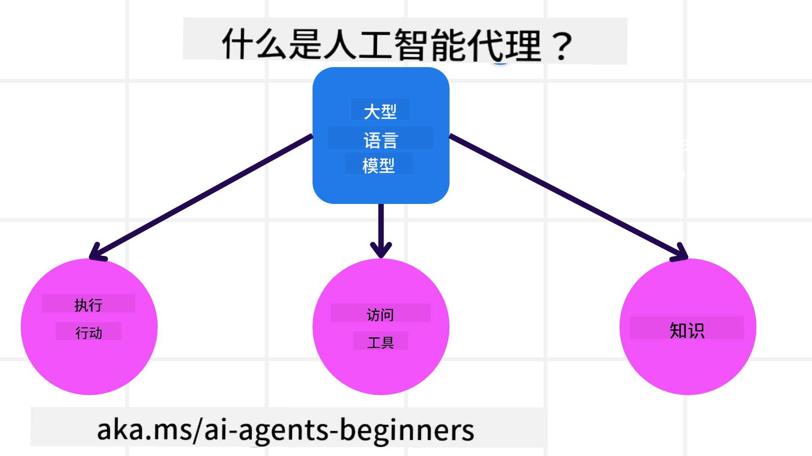
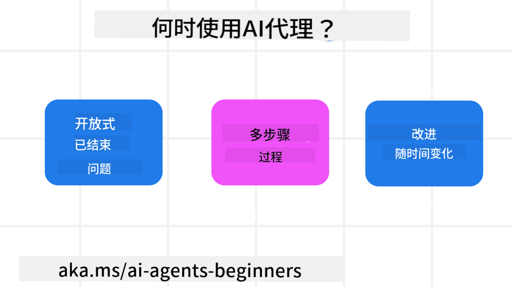

<!--
CO_OP_TRANSLATOR_METADATA:
{
  "original_hash": "d84943abc8f001ad4670418d32c2d899",
  "translation_date": "2025-05-20T07:02:09+00:00",
  "source_file": "01-intro-to-ai-agents/README.md",
  "language_code": "zh"
}
-->
与其他学习者和AI代理构建者交流，提出你对本课程的任何疑问。

开始本课程前，我们先深入了解什么是AI代理，以及如何在我们构建的应用和工作流程中使用它们。

## 介绍

本课内容包括：

- 什么是AI代理及不同类型的代理？
- AI代理适合哪些使用场景，它们能为我们带来什么帮助？
- 设计代理解决方案时的一些基本构建模块是什么？

## 学习目标
完成本课后，你应能够：

- 理解AI代理的概念及其与其他AI解决方案的区别。
- 更高效地应用AI代理。
- 为用户和客户设计高效的代理解决方案。

## AI代理的定义及类型

### 什么是AI代理？

AI代理是**系统**，通过赋予**大型语言模型（LLMs）**对**工具**和**知识**的访问能力，扩展其功能，从而使其能够**执行操作**。

我们将这个定义拆解成几个部分：

- **系统**——重要的是要把代理看作由多个组件组成的系统，而不仅仅是单一组件。AI代理的基本组成包括：
  - **环境**——AI代理所运行的定义空间。例如，对于一个旅行预订AI代理，环境可能是该代理用来完成任务的旅行预订系统。
  - **传感器**——环境包含信息并提供反馈。AI代理通过传感器收集和解读环境当前状态的信息。在旅行预订代理的例子中，预订系统可能提供酒店空房情况或航班价格等信息。
  - **执行器**——AI代理获取环境当前状态后，会根据当前任务决定执行何种操作以改变环境。对于旅行预订代理，可能是为用户预订一个可用的房间。

**大型语言模型**——代理的概念早于LLMs的出现。使用LLMs构建AI代理的优势在于它们能够理解人类语言和数据，从而解释环境信息并制定改变环境的计划。

**执行操作**——在AI代理系统之外，LLMs的操作通常局限于根据用户提示生成内容或信息。在AI代理系统内，LLMs通过解读用户请求并利用环境中可用的工具来完成任务。

**访问工具**——LLM可访问的工具由其所处环境和AI代理开发者共同决定。以旅行代理为例，代理所能使用的工具受限于预订系统提供的操作，开发者也可以限制代理对航班的访问权限。

**记忆与知识**——记忆可以是短期的，体现在用户与代理的对话上下文中。长期记忆则超出环境提供的信息，AI代理还可以从其他系统、服务、工具甚至其他代理中检索知识。以旅行代理为例，用户的旅行偏好信息可能存储在客户数据库中。

### 不同类型的代理

了解了AI代理的一般定义后，我们来看几种具体的代理类型，以及它们如何应用于旅行预订AI代理。

| **代理类型**                | **描述**                                                                                                                       | **示例**                                                                                                                                                                                                                   |
| ----------------------------- | ------------------------------------------------------------------------------------------------------------------------------------- | ----------------------------------------------------------------------------------------------------------------------------------------------------------------------------------------------------------------------------- |
| **简单反射代理**      | 根据预定义规则立即执行操作。                                                                                  | 旅行代理根据邮件内容，将旅行投诉转发给客户服务部门。                                                                                                                          |
| **基于模型的反射代理** | 根据对世界模型及其变化的理解执行操作。                                                              | 旅行代理根据历史价格数据，优先处理价格变动较大的路线。                                                                                                             |
| **基于目标的代理**         | 通过理解目标并制定行动计划来实现特定目标。                                  | 旅行代理通过确定从当前位置到目的地所需的交通安排（如汽车、公共交通、航班）来预订行程。                                                                                |
| **基于效用的代理**      | 考虑偏好并以数值权衡取舍来决定如何实现目标。                                               | 旅行代理在预订时权衡便利性与成本，最大化效用。                                                                                                                                          |
| **学习型代理**           | 通过反馈不断改进，调整行为。                                                        | 旅行代理通过行程后调查中的客户反馈改进未来的预订。                                                                                                               |
| **分层代理**       | 由多个层级代理组成，高层代理将任务拆分为子任务，由低层代理完成。 | 旅行代理取消行程时，将任务拆分为取消具体预订等子任务，由低层代理执行并向高层代理汇报。                                     |
| **多代理系统（MAS）** | 代理独立完成任务，既可合作也可竞争。                                                           | 合作：多个代理分别预订酒店、航班和娱乐服务。竞争：多个代理竞争共享的酒店预订日历，为客户预订房间。 |

## 何时使用AI代理

前文中我们用旅行代理案例说明了不同类型代理在旅行预订场景中的应用。我们将继续以此应用贯穿课程内容。

来看AI代理最适合的使用场景：

- **开放性问题**——允许LLM自行确定完成任务所需的步骤，因为这些步骤不总能硬编码到工作流中。
- **多步骤流程**——任务复杂，需要AI代理在多轮交互中使用工具或信息，而非一次性检索。
- **持续改进**——代理可通过环境或用户反馈不断优化，以提供更高效的服务。

关于使用AI代理的更多考量，我们将在《构建可信AI代理》课程中详细介绍。

## 代理解决方案基础

### 代理开发

设计AI代理系统的第一步是定义工具、动作和行为。本课程聚焦使用**Azure AI Agent Service**来定义代理。它提供以下功能：

- 支持OpenAI、Mistral、Llama等开放模型选择
- 通过Tripadvisor等供应商使用授权数据
- 使用标准化的OpenAPI 3.0工具

### 代理模式

与LLMs的交互通过提示完成。鉴于AI代理的半自主特性，环境变化后并不总是需要或可能手动重新提示LLM。我们采用**代理模式**，使得在多步骤中以更可扩展的方式提示LLM成为可能。

本课程将介绍当前流行的一些代理模式。

### 代理框架

代理框架允许开发者通过代码实现代理模式。这些框架提供模板、插件和工具，提升AI代理的协作能力，并增强系统的可观测性和故障排查能力。

课程中我们将探索研究驱动的AutoGen框架和面向生产的Semantic Kernel的Agent框架。

## 上一课

[课程设置](../00-course-setup/README.md)

## 下一课

[探索代理框架](../02-explore-agentic-frameworks/README.md)

**免责声明**：  
本文件由 AI 翻译服务 [Co-op Translator](https://github.com/Azure/co-op-translator) 翻译而成。虽然我们力求准确，但请注意，自动翻译可能存在错误或不准确之处。原始文档的原文版本应被视为权威来源。对于重要信息，建议使用专业人工翻译。我们不对因使用本翻译而产生的任何误解或误释承担责任。