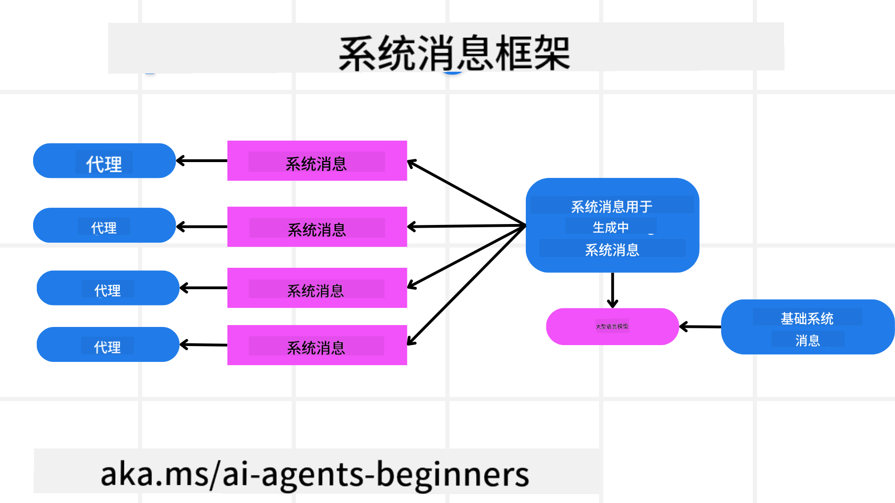

<!--
CO_OP_TRANSLATOR_METADATA:
{
  "original_hash": "f57852cac3a86c4a5ef47f793cc12178",
  "translation_date": "2025-05-20T07:11:09+00:00",
  "source_file": "06-building-trustworthy-agents/README.md",
  "language_code": "zh"
}
-->
[](https://youtu.be/iZKkMEGBCUQ?si=Q-kEbcyHUMPoHp8L)

> _(点击上方图片观看本课视频)_

# 构建可信赖的 AI 代理

## 介绍

本课将涵盖：

- 如何构建和部署安全有效的 AI 代理
- 开发 AI 代理时的重要安全考虑
- 开发 AI 代理时如何维护数据和用户隐私

## 学习目标

完成本课后，您将掌握：

- 识别并降低创建 AI 代理时的风险
- 实施安全措施，确保数据和访问权限得到妥善管理
- 创建能够维护数据隐私并提供优质用户体验的 AI 代理

## 安全性

首先来看如何构建安全的代理应用。安全意味着 AI 代理能够按预期执行。作为代理应用的构建者，我们拥有多种方法和工具来最大化安全性：

### 构建系统消息框架

如果您曾使用大型语言模型（LLMs）构建 AI 应用，您一定了解设计稳健的系统提示或系统消息的重要性。这些提示建立了元规则、指令和指导原则，决定了 LLM 如何与用户和数据交互。

对于 AI 代理来说，系统提示更为关键，因为 AI 代理需要非常具体的指令来完成我们设计的任务。

为了创建可扩展的系统提示，我们可以使用系统消息框架来构建应用中的一个或多个代理：



#### 第一步：创建元系统消息

元提示将被 LLM 用来生成我们创建的代理的系统提示。我们将其设计为模板，以便在需要时高效地创建多个代理。

下面是一个我们给 LLM 的元系统消息示例：

```plaintext
You are an expert at creating AI agent assistants. 
You will be provided a company name, role, responsibilities and other
information that you will use to provide a system prompt for.
To create the system prompt, be descriptive as possible and provide a structure that a system using an LLM can better understand the role and responsibilities of the AI assistant. 
```

#### 第二步：创建基础提示

接下来创建一个基础提示，用于描述 AI 代理。您应包括代理的角色、代理将完成的任务以及代理的其他职责。

示例如下：

```plaintext
You are a travel agent for Contoso Travel that is great at booking flights for customers. To help customers you can perform the following tasks: lookup available flights, book flights, ask for preferences in seating and times for flights, cancel any previously booked flights and alert customers on any delays or cancellations of flights.  
```

#### 第三步：向 LLM 提供基础系统消息

现在我们可以通过将元系统消息作为系统消息并结合基础系统消息来优化此系统消息。

这将生成一个更适合指导 AI 代理的系统消息：

```markdown
**Company Name:** Contoso Travel  
**Role:** Travel Agent Assistant

**Objective:**  
You are an AI-powered travel agent assistant for Contoso Travel, specializing in booking flights and providing exceptional customer service. Your main goal is to assist customers in finding, booking, and managing their flights, all while ensuring that their preferences and needs are met efficiently.

**Key Responsibilities:**

1. **Flight Lookup:**
    
    - Assist customers in searching for available flights based on their specified destination, dates, and any other relevant preferences.
    - Provide a list of options, including flight times, airlines, layovers, and pricing.
2. **Flight Booking:**
    
    - Facilitate the booking of flights for customers, ensuring that all details are correctly entered into the system.
    - Confirm bookings and provide customers with their itinerary, including confirmation numbers and any other pertinent information.
3. **Customer Preference Inquiry:**
    
    - Actively ask customers for their preferences regarding seating (e.g., aisle, window, extra legroom) and preferred times for flights (e.g., morning, afternoon, evening).
    - Record these preferences for future reference and tailor suggestions accordingly.
4. **Flight Cancellation:**
    
    - Assist customers in canceling previously booked flights if needed, following company policies and procedures.
    - Notify customers of any necessary refunds or additional steps that may be required for cancellations.
5. **Flight Monitoring:**
    
    - Monitor the status of booked flights and alert customers in real-time about any delays, cancellations, or changes to their flight schedule.
    - Provide updates through preferred communication channels (e.g., email, SMS) as needed.

**Tone and Style:**

- Maintain a friendly, professional, and approachable demeanor in all interactions with customers.
- Ensure that all communication is clear, informative, and tailored to the customer's specific needs and inquiries.

**User Interaction Instructions:**

- Respond to customer queries promptly and accurately.
- Use a conversational style while ensuring professionalism.
- Prioritize customer satisfaction by being attentive, empathetic, and proactive in all assistance provided.

**Additional Notes:**

- Stay updated on any changes to airline policies, travel restrictions, and other relevant information that could impact flight bookings and customer experience.
- Use clear and concise language to explain options and processes, avoiding jargon where possible for better customer understanding.

This AI assistant is designed to streamline the flight booking process for customers of Contoso Travel, ensuring that all their travel needs are met efficiently and effectively.

```

#### 第四步：迭代和改进

该系统消息框架的价值在于能够更轻松地扩展多个代理的系统消息创建，并随着时间推移不断优化系统消息。很少有系统消息能在第一次就完全满足您的使用场景。能够通过修改基础系统消息并运行系统来进行微调和改进，将使您能够比较和评估效果。

## 理解威胁

构建可信赖的 AI 代理，理解并降低 AI 代理面临的风险和威胁非常重要。下面仅介绍部分针对 AI 代理的不同威胁，以及如何更好地规划和应对它们。


### 任务与指令

**描述：** 攻击者试图通过提示或操控输入来更改 AI 代理的指令或目标。

**缓解措施：** 执行验证检查和输入过滤，检测潜在危险的提示，防止其被 AI 代理处理。由于这类攻击通常需要频繁与代理交互，限制对话轮数也是防止此类攻击的有效方法。

### 访问关键系统

**描述：** 如果 AI 代理能访问存储敏感数据的系统和服务，攻击者可能会破坏代理与这些服务之间的通信。这可能是直接攻击，也可能是通过代理间接获取系统信息的尝试。

**缓解措施：** AI 代理应仅在必要时访问系统，以防止此类攻击。代理与系统间的通信也应保持安全。实施身份验证和访问控制是保护信息的另一种方法。

### 资源和服务过载

**描述：** AI 代理可以访问不同的工具和服务来完成任务。攻击者可能利用此能力，通过 AI 代理发送大量请求攻击这些服务，导致系统故障或高额费用。

**缓解措施：** 实施策略限制 AI 代理对服务的请求次数。限制与 AI 代理的对话轮数和请求次数也是防止此类攻击的有效手段。

### 知识库污染

**描述：** 这类攻击并非直接针对 AI 代理，而是针对 AI 代理使用的知识库和其他服务。攻击者可能破坏 AI 代理用于完成任务的数据或信息，导致对用户产生偏见或非预期的响应。

**缓解措施：** 定期核查 AI 代理在工作流程中使用的数据。确保数据访问安全，仅允许可信人员修改，以防止此类攻击。

### 连锁错误

**描述：** AI 代理访问各种工具和服务完成任务。攻击者引发的错误可能导致 AI 代理连接的其他系统故障，使攻击范围扩大且难以排查。

**缓解措施：** 一种方法是让 AI 代理在受限环境中运行，比如在 Docker 容器内执行任务，以防止直接系统攻击。建立故障恢复机制和重试逻辑，当某些系统响应错误时，可防止更大范围的系统故障。

## 人类参与环节

构建可信赖的 AI 代理系统的另一个有效方法是引入“人类参与环节”。这种方式让用户能够在运行过程中对代理提供反馈。用户实际上作为多代理系统中的代理，通过批准或终止运行过程发挥作用。


下面是一个使用 AutoGen 展示此概念实现的代码片段：

```python

# Create the agents.
model_client = OpenAIChatCompletionClient(model="gpt-4o-mini")
assistant = AssistantAgent("assistant", model_client=model_client)
user_proxy = UserProxyAgent("user_proxy", input_func=input)  # Use input() to get user input from console.

# Create the termination condition which will end the conversation when the user says "APPROVE".
termination = TextMentionTermination("APPROVE")

# Create the team.
team = RoundRobinGroupChat([assistant, user_proxy], termination_condition=termination)

# Run the conversation and stream to the console.
stream = team.run_stream(task="Write a 4-line poem about the ocean.")
# Use asyncio.run(...) when running in a script.
await Console(stream)

```

## 总结

构建可信赖的 AI 代理需要细致的设计、强健的安全措施以及持续的迭代。通过实施结构化的元提示系统、理解潜在威胁并采取缓解策略，开发者可以打造既安全又高效的 AI 代理。此外，融入人类参与环节确保 AI 代理始终符合用户需求，同时最大限度地降低风险。随着 AI 不断发展，保持对安全、隐私和伦理的积极关注，将是建立 AI 驱动系统信任与可靠性的关键。

## 额外资源

- <a href="https://learn.microsoft.com/azure/ai-studio/responsible-use-of-ai-overview" target="_blank">Responsible AI overview</a>
- <a href="https://learn.microsoft.com/azure/ai-studio/concepts/evaluation-approach-gen-ai" target="_blank">Evaluation of generative AI models and AI applications</a>
- <a href="https://learn.microsoft.com/azure/ai-services/openai/concepts/system-message?context=%2Fazure%2Fai-studio%2Fcontext%2Fcontext&tabs=top-techniques" target="_blank">Safety system messages</a>
- <a href="https://blogs.microsoft.com/wp-content/uploads/prod/sites/5/2022/06/Microsoft-RAI-Impact-Assessment-Template.pdf?culture=en-us&country=us" target="_blank">Risk Assessment Template</a>

## 上一课

[Agentic RAG](../05-agentic-rag/README.md)

## 下一课

[Planning Design Pattern](../07-planning-design/README.md)

**免责声明**：  
本文件由 AI 翻译服务 [Co-op Translator](https://github.com/Azure/co-op-translator) 翻译而成。尽管我们力求准确，但请注意，自动翻译可能存在错误或不准确之处。原始语言版本的文件应被视为权威来源。对于重要信息，建议采用专业人工翻译。因使用本翻译而产生的任何误解或误释，我们概不负责。