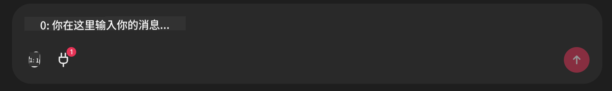

<!--
CO_OP_TRANSLATOR_METADATA:
{
  "original_hash": "393eea8000f305b94010dd5b380902d8",
  "translation_date": "2025-05-20T10:01:15+00:00",
  "source_file": "11-mcp/code_samples/github-mcp/README.md",
  "language_code": "zh"
}
-->
# Github MCP 服务器示例

## 描述

这是为微软 Reactor 举办的 AI Agents 黑客松创建的演示。

该工具用于根据用户的 Github 仓库推荐黑客松项目。
具体步骤如下：

1. **Github Agent** - 使用 Github MCP 服务器获取仓库及其相关信息。
2. **Hackathon Agent** - 利用 Github Agent 提供的数据，根据用户的项目、使用的语言以及 AI Agents 黑客松的项目赛道，提出有创意的黑客松项目想法。
3. **Events Agent** - 根据 Hackathon Agent 的建议，Events Agent 会推荐 AI Agent 黑客松系列中相关的活动。

## 运行代码

### 环境变量

本演示使用 Azure Open AI Service、Semantic Kernel、Github MCP 服务器和 Azure AI Search。

请确保已正确设置相应的环境变量以使用这些工具：

```python
AZURE_OPENAI_CHAT_DEPLOYMENT_NAME=""
AZURE_OPENAI_EMBEDDING_DEPLOYMENT_NAME=""
AZURE_OPENAI_ENDPOINT=""
AZURE_OPENAI_API_KEY=""
AZURE_OPENAI_API_VERSION=""
AZURE_SEARCH_SERVICE_ENDPOINT=""
AZURE_SEARCH_API_KEY=""
``` 

## 运行 Chainlit 服务器

为了连接 MCP 服务器，本演示使用 Chainlit 作为聊天界面。

在终端中运行以下命令启动服务器：

```bash
chainlit run app.py -w
```

这将启动你的 Chainlit 服务器，地址为 `localhost:8000` as well as populate your Azure AI Search Index with the `event-descriptions.md` 内容。

## 连接 MCP 服务器

要连接 Github MCP 服务器，请点击“Type your message here..”聊天框下方的“插头”图标：



然后点击“Connect an MCP”以添加连接 Github MCP 服务器的命令：

```bash
npx -y @modelcontextprotocol/server-github --env GITHUB_PERSONAL_ACCESS_TOKEN=[YOUR PERSONAL ACCESS TOKEN]
```

将 “[YOUR PERSONAL ACCESS TOKEN]” 替换为你的个人访问令牌。

连接成功后，插头图标旁应显示 (1) 以确认连接状态。如果未显示，请尝试使用 `chainlit run app.py -w` 重启 Chainlit 服务器。

## 使用演示

要启动推荐黑客松项目的代理工作流程，你可以输入类似以下内容的消息：

“Recommend hackathon projects for the Github user koreyspace”

**目前我们通过检测“reccomend”和“github”这两个词来启动此工作流程。后续将由 Router Agent 来处理。**

**免责声明**：  
本文件由 AI 翻译服务 [Co-op Translator](https://github.com/Azure/co-op-translator) 进行翻译。虽然我们努力确保翻译的准确性，但请注意，自动翻译可能存在错误或不准确之处。原始文件的母语版本应被视为权威来源。对于重要信息，建议采用专业人工翻译。我们不对因使用本翻译而产生的任何误解或误释承担责任。